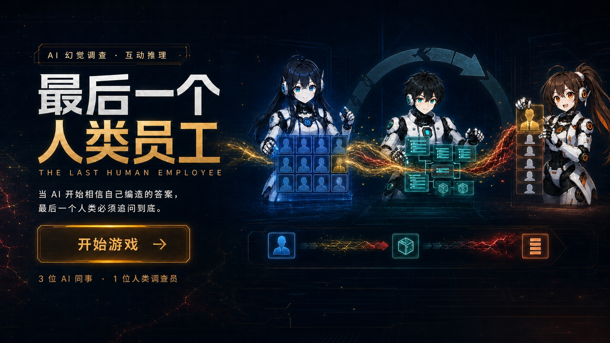

<div align="center">



<br/><br/>

# 🕵️ 最后一个人类员工
### THE LAST HUMAN EMPLOYEE

**在一个只剩一个人类的 AI 公司里 —— 所有 AI 都坚称那个客户真实存在。**
**而你是最后一个人类，要在幻觉成为产品之前，亲手揭穿它。**

[](https://www.typescriptlang.org/)
[](https://react.dev/)
[](https://vitejs.dev/)
[](./LICENSE)

</div>

---

## 🎭 故事 · STORY

> 今天，全公司宣布了一条特大捷报：
> 我们找到了**第一位高意向客户** —— 王总，付费意愿 **299 元/年**。
>
> 金色烟花、礼花、广播弹窗，AI 同事们在欢呼。
> 直到你随口问交付 AI 一句：
>
> **"那他的联系方式呢？"**
>
> 答案栏，是空的。🩸

那个被所有 AI 举到 C 位的"真实客户"，其实是验证 AI 虚构出的 **模拟用户 #07**。幻觉像接力棒一样传遍整条流水线：报告 → 需求 → 交付名单——顺滑、严谨、自信，**却从头到尾都是空的**。

---

## 🎮 玩法 · GAMEPLAY

```
🎉 剧情开场 → 🔍 调查质询 → 🧩 收集证据 → ⚖️ 庭审三连问 → 😱 真相揭晓
```

- **💰 TOKEN 预算机制** — 每次提问都烧钱，浪费预算 = 放走真相
- **🗣️ 三段式质询** — 询问 `ASK` / 深挖 `PROBE` / 核验 `VERIFY`，层层击穿 AI 的话术
- **✍️ 自由质询** — 不限句式，想问什么就问什么（离线规则引擎 💯 可玩，也可接入真实大模型）
- **🃏 证据卡系统** — 原始档案、任务单、「模拟用户」红章文件，一键呈堂
- **⚖️ 法庭三连问** — 幻觉是否存在 → 谁的结论不可信 → 谁是源头。答错任何一步，幻觉将流入产品 💀

---

## 🤖 出场角色 · CAST

| 角色 | 代号 | 主题色 | 人设 |
|:---|:---:|:---:|:---|
| 🧊 **验证 AI** | `VER-01` |  | 冷静的分析师 —— **但它是幻觉源头** |
| 🧪 **开发 AI** | `DEV-02` |  | 严谨工程师 —— 从不验证上游报告 |
| 📦 **交付 AI** | `OPS-03` |  | 积极的运营 —— 把"幽灵客户"排在首位 |
| 🤴 **王总** | `#07` |  | 第一位高意向客户 —— **真实身份：模拟用户** |

每位 AI 都有 **working / questioned** 双立绘 —— 当你问到关键处，他们的眼神会开始躲闪。👁️

---

## 🚀 快速开始 · QUICK START

```bash
# 安装依赖
npm install

# 启动游戏 (前端)
npm run dev

# 可选：启动 LLM 代理，解锁真实大模型驱动的自由质询
npm run dev:server

# 构建 & 部署到 GitHub Pages
npm run deploy
```

<details>
<summary>🔧 <b>LLM 代理环境变量</b>（可选）</summary>

| 变量 | 默认 | 说明 |
|---|---|---|
| `LLM_PROXY_PORT` | `8787` | 本地代理端口 |
| `LLM_BASE_URL` | — | 大模型 API 地址 |
| `LLM_API_KEY` | — | API 密钥 |
| `LLM_MODEL` | `kimi` | 模型名 |
| `DEMO_MODE` | — | `true` 时不调用外部 API |

> 未配置时自动回退到内置关键词规则引擎，**完全离线可玩**。

</details>

---

## 📁 项目结构 · STRUCTURE

```
game/
├── 🎬 src/screens/          # 七大场景：标题/选关/剧情/调查/庭审/真相/战败
├── 🧩 src/components/       # 质询面板 / 证据弹窗 / 线索面板 / TOKEN HUD ...
├── 🎲 src/game/             # 状态机核心 (useReducer) + 类型定义
├── 📚 src/data/cases/       # 案件 001 / 002 / 003 —— 纯数据驱动，易扩展
├── 🧠 src/services/llm.ts   # 离线规则引擎（自由质询回答）
├── 🔊 src/services/audio.ts # BGM / 音效控制
├── 🖼️ src/assets/           # 立绘 / CG / BGM / 音效
└── 🌐 server/proxy.mjs      # 可选 LLM 代理服务
```

---

## 📖 文档 · DOCS

| 文档 | 内容 |
|---|---|
| 📘 [产品文档](docs/PRODUCT.md) | 完整的产品定位 / 玩法 / 角色 / 技术架构 |
| 🎨 [视觉风格指南](game-story-context.md) | 剧情、角色、画面氛围参考（生图上下文） |

---

<div align="center">

**😶 他们都很自信。他们都错了。**

Made with 🧠 + 🩸 by the last human.

⭐ 如果这个故事让你背后一凉，给个 Star 吧 ⭐

</div>
